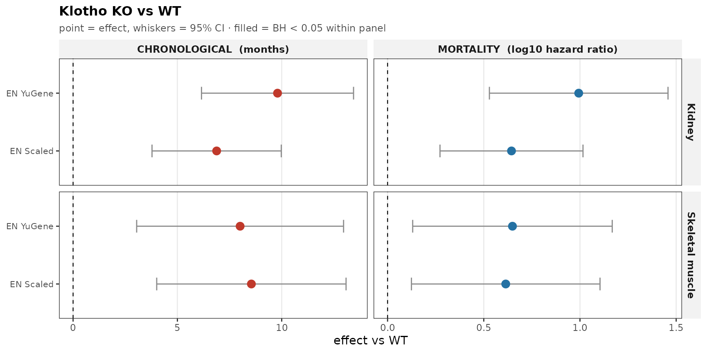
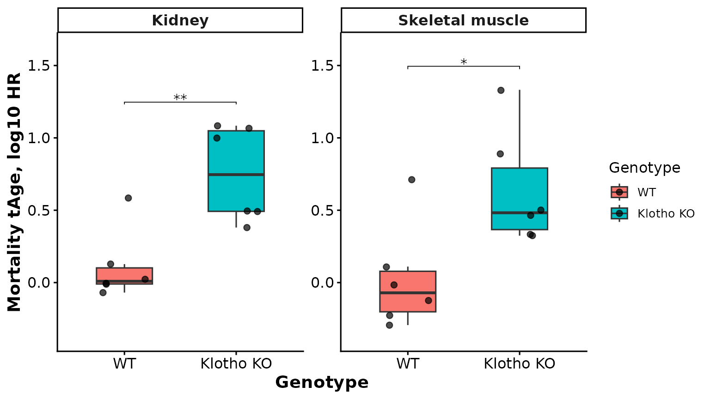

# Transcriptomic age from bulk RNA-seq with tAge

## Overview

`tAge` applies the transcriptomic clocks from [Tyshkovskiy et
al. (2026), *Nature*](https://doi.org/10.1038/s41586-026-10542-3) to
bulk RNA-seq data, predicting **chronological age** (in age units) and
**expected mortality** (as a `log10` hazard ratio).

The workflow: build an `ExpressionSet`, preprocess it, and predict.

## 1. Build an ExpressionSet

We use the mouse example data bundled with the package (genes × samples
raw counts, plus sample metadata).

``` r

exprs_data <- load_example_expression_data()
metadata   <- load_example_metadata()

eset <- make_ExpressionSet(exprs_data, metadata, verbose = FALSE)
eset
#> ExpressionSet (storageMode: lockedEnvironment)
#> assayData: 57010 features, 24 samples 
#>   element names: exprs 
#> protocolData: none
#> phenoData
#>   sampleNames: Klo93K Klo94K ... RNA_122M (24 total)
#>   varLabels: Mouse.ID Genotype Sex Tissue
#>   varMetadata: labelDescription
#> featureData: none
#> experimentData: use 'experimentData(object)'
#> Annotation:
```

## 2. Preprocess

[`tAge_preprocessing()`](https://gladyshev-lab.github.io/tAge/reference/tAge_preprocessing.md)
filters low-expressed genes, maps them to the mouse Entrez gene space
(the identifier type is detected), RLE-normalises, log-transforms,
scales (per sample), applies the YuGene transform, aligns to the clock
gene list, and centres the data.

The example holds two tissues. The clocks were trained on expression
centred within each dataset and tissue against matched controls, so we
preprocess and centre each tissue on its own wild-type samples
(`split_by`), and keep genes seen in at least 25% of samples, as the
paper did for this dataset.

``` r

tAge_eset <- tAge_preprocessing(
  eset,
  species = "mouse",
  split_by = "Tissue",
  control_group_column = "Genotype",
  control_group_label  = "WT",
  percent_threshold = 25,
  verbose = FALSE
)
#> calcNormFactors has been renamed to normLibSizes
#> calcNormFactors has been renamed to normLibSizes
names(tAge_eset)
#> [1] "RLE_normalized"  "log_transformed" "scaled"          "scaled_diff"    
#> [5] "yugene"          "yugene_diff"
```

Prediction uses the `scaled_diff` and `yugene_diff` representations. The
species is recorded in these objects, so
[`predict_tAge()`](https://gladyshev-lab.github.io/tAge/reference/predict_tAge.md)
does not need it.

## 3. Browse and download clocks

The published clocks live on Zenodo; list them from R (reads the bundled
registry):

``` r

head(list_clocks(type = "EN", outcome = "Mortality"))
#>                                               filename type   outcome
#> 1        EN_Mortality_Mouse_Multitissue_scaleddiff.pkl   EN Mortality
#> 2        EN_Mortality_Mouse_Multitissue_yugenediff.pkl   EN Mortality
#> 3 EN_Mortality_Multispecies_Multitissue_scaleddiff.pkl   EN Mortality
#> 4 EN_Mortality_Multispecies_Multitissue_yugenediff.pkl   EN Mortality
#> 5            EN_Mortality_Rodents_Liver_scaleddiff.pkl   EN Mortality
#> 6            EN_Mortality_Rodents_Liver_yugenediff.pkl   EN Mortality
#>        species       tissue scaling lifespan_scaled
#> 1        Mouse Multi-Tissue  Scaled           FALSE
#> 2        Mouse Multi-Tissue  YuGene           FALSE
#> 3 Multispecies Multi-Tissue  Scaled           FALSE
#> 4 Multispecies Multi-Tissue  YuGene           FALSE
#> 5      Rodents        Liver  Scaled           FALSE
#> 6      Rodents        Liver  YuGene           FALSE
```

[`download_clocks()`](https://gladyshev-lab.github.io/tAge/reference/download_clocks.md)
fetches a chosen set and returns a `path` column:

``` r

clocks <- list_clocks(type = "EN", outcome = "Mortality",
                      species = "Multispecies", tissue = "Multi-Tissue")
clocks <- download_clocks(clocks, dest_dir = "clocks")

model_paths <- list(
  scaled_diff = clocks$path[clocks$scaling == "Scaled"],
  yugene_diff = clocks$path[clocks$scaling == "YuGene"]
)
```

## 4. Predict

[`predict_tAge()`](https://gladyshev-lab.github.io/tAge/reference/predict_tAge.md)
takes one model per normalisation, so applying several clocks means one
call per outcome. Renaming the columns as we go keeps them apart and
builds the clock table the figures use.

``` r

Sys.setenv(RETICULATE_PYTHON = Sys.getenv("RETICULATE_PYTHON"))  # use your env

predict_one_outcome <- function(outcome) {
  cl <- .clocks[.clocks$outcome == outcome, ]
  res <- predict_tAge(
    tAge_eset,
    model_paths = list(scaled_diff = cl$path[cl$scaling == "Scaled"],
                       yugene_diff = cl$path[cl$scaling == "YuGene"]),
    mode = "EN"
  )
  out <- res[, c("scaled_diff_EN_tAge", "yugene_diff_EN_tAge"), drop = FALSE]
  names(out) <- paste0(outcome, c("_Scaled", "_YuGene"))
  out
}

results <- cbind(
  Biobase::pData(tAge_eset$scaled_diff),
  predict_one_outcome("Chronological"),
  predict_one_outcome("Mortality")
)

# The table the figures use to label rows and pick units per outcome.
clocks_meta <- data.frame(
  filename = c("Chronological_Scaled", "Chronological_YuGene",
               "Mortality_Scaled", "Mortality_YuGene"),
  name     = c("EN Scaled", "EN YuGene", "EN Scaled", "EN YuGene"),
  outcome  = rep(c("Chronological", "Mortality"), each = 2),
  stringsAsFactors = FALSE
)

head(results[, c("Genotype", "Tissue", "Mortality_Scaled")])
#>         Genotype Tissue Mortality_Scaled
#> Klo93K        WT Kidney      0.022934135
#> Klo94K        WT Kidney     -0.068923471
#> Klo95K        WT Kidney      0.127629789
#> Klo96K        WT Kidney      0.584237945
#> Klo99K        WT Kidney     -0.011345993
#> Klo100K       WT Kidney     -0.004835266
```

The mortality values are `log10(hazard ratio)` — small numbers centred
near zero, **not** ages. See below.

## 5. Compare groups

[`tage_compare_groups()`](https://gladyshev-lab.github.io/tAge/reference/tage_compare_groups.md)
is the test behind every figure in the package: estimated marginal-mean
contrasts of `tAge ~ group + covariates`, one model per stratum, as in
the paper’s clock analyses.

``` r

stats <- tage_compare_groups(
  results,
  value_columns   = clocks_meta$filename,
  group_column    = "Genotype",
  reference_group = "WT",
  split_by        = "Tissue",
  p_adjust        = "BH",
  p_adjust_scope  = "across_columns"   # correct across the clocks in one panel
)

stats[, c("value_column", "split", "group2", "estimate",
          "ci_low", "ci_high", "p_adjusted", "label")]
#>           value_column           split    group2  estimate    ci_low   ci_high
#> 1 Chronological_Scaled          Kidney Klotho KO 6.8815265 3.7835072  9.979546
#> 2 Chronological_Scaled Skeletal muscle Klotho KO 8.5465910 4.0084004 13.084782
#> 3 Chronological_YuGene          Kidney Klotho KO 9.7994616 6.1556913 13.443232
#> 4 Chronological_YuGene Skeletal muscle Klotho KO 8.0065956 3.0476482 12.965543
#> 5     Mortality_Scaled          Kidney Klotho KO 0.6441031 0.2724851  1.015721
#> 6     Mortality_Scaled Skeletal muscle Klotho KO 0.6141689 0.1241048  1.104233
#> 7     Mortality_YuGene          Kidney Klotho KO 0.9934256 0.5292257  1.457625
#> 8     Mortality_YuGene Skeletal muscle Klotho KO 0.6491303 0.1306110  1.167650
#>     p_adjusted label
#> 1 0.0010118358    **
#> 2 0.0073594525    **
#> 3 0.0005338923   ***
#> 4 0.0097361695    **
#> 5 0.0031504821    **
#> 6 0.0191398010     *
#> 7 0.0010118358    **
#> 8 0.0191398010     *
```

`estimate` is always `group2 - group1`, in the clock’s own units, and
`ci_low`/`ci_high` are the 95% interval. A few arguments are worth
knowing:

- `covariates` puts nuisance variables in the model instead of ignoring
  them.
- `se_columns` switches to the weighted meta-regression for Bayesian
  ridge clocks — pass the `_sd` columns that `predict_tAge(mode = "BR")`
  returns.
- `variance_strata` chooses whether the residual variance comes from the
  two compared groups or from every group present.
- `p_adjust_scope` chooses the correction family: `"within_column"`
  across the comparisons of one clock, `"across_columns"` across clocks
  within a comparison, or `"global"`.

## 6. Figures

[`tage_clock_forest()`](https://gladyshev-lab.github.io/tAge/reference/tage_clock_forest.md)
shows every clock at once with its uncertainty. Filled markers cleared
the correction; hollow ones did not.

``` r

tage_clock_forest(
  results,
  clocks_meta     = clocks_meta,
  group_column    = "Genotype",
  reference_group = "WT",
  compare_groups  = "Klotho KO",
  split_by        = "Tissue",
  title           = "Klotho KO vs WT"
)
```



For a single clock,
[`tage_boxplot()`](https://gladyshev-lab.github.io/tAge/reference/tage_boxplot.md)
shows the samples themselves. It annotates the brackets from the same
engine, so the stars agree with the table above.

``` r

tage_boxplot(
  results,
  x_var        = "Genotype",
  y_var        = "Mortality_Scaled",
  subgroup_var = "Tissue",
  x_order      = c("WT", "Klotho KO"),
  ylab         = "Mortality tAge, log10 HR"
)
```



When the clocks are module clocks,
[`tage_module_heatmap()`](https://gladyshev-lab.github.io/tAge/reference/tage_module_heatmap.md)
is the equivalent figure: modules on the rows, strata on the columns,
effects in the cells.

## 7. Interpreting the output

| Outcome | Units | Notes |
|----|----|----|
| Chronological | months (rodents) / years (primates) | normalised age rescaled by species max lifespan; `age_units` overrides |
| Mortality | `log10(hazard ratio)` | **not** an age; higher = higher expected mortality |
| Normalized age | fraction of max lifespan | `normalized_age = "percent"` for the paper’s percent scale |

`tAge` looks up each clock in the registry and rescales **only**
chronological clocks to age units; `attr(results, "tage_units")` records
the unit of every column. The example’s KO effect is partly driven by
the *Klotho* gene itself, which the distributed clocks contain and the
paper’s Klotho analysis excluded.

## 8. Reference groups (centring)

All distributed clocks are *relative*: they operate on expression
centred against a reference group.

- **Default (no reference group):** centre on all samples (overall
  per-gene median) — a general cohort readout.
- **Matched controls:** pass `control_group_column` and
  `control_group_label` to
  [`tAge_preprocessing()`](https://gladyshev-lab.github.io/tAge/reference/tAge_preprocessing.md)
  to centre on matched controls (recommended for treatment-vs-control
  designs),
  e.g. `control_group_column = "Genotype", control_group_label = "WT"`.
- **Several tissues / datasets:** add `split_by` so that every stratum
  is filtered, normalised and centred on its own controls, as the clocks
  were trained. That is what section 2 does with `split_by = "Tissue"`.

## Session info

``` r

sessionInfo()
#> R version 4.6.1 (2026-06-24)
#> Platform: x86_64-pc-linux-gnu
#> Running under: Ubuntu 24.04.5 LTS
#> 
#> Matrix products: default
#> BLAS:   /usr/lib/x86_64-linux-gnu/openblas-pthread/libblas.so.3 
#> LAPACK: /usr/lib/x86_64-linux-gnu/openblas-pthread/libopenblasp-r0.3.26.so;  LAPACK version 3.12.0
#> 
#> locale:
#>  [1] LC_CTYPE=C.UTF-8       LC_NUMERIC=C           LC_TIME=C.UTF-8       
#>  [4] LC_COLLATE=C.UTF-8     LC_MONETARY=C.UTF-8    LC_MESSAGES=C.UTF-8   
#>  [7] LC_PAPER=C.UTF-8       LC_NAME=C              LC_ADDRESS=C          
#> [10] LC_TELEPHONE=C         LC_MEASUREMENT=C.UTF-8 LC_IDENTIFICATION=C   
#> 
#> time zone: UTC
#> tzcode source: system (glibc)
#> 
#> attached base packages:
#> [1] stats     graphics  grDevices utils     datasets  methods   base     
#> 
#> other attached packages:
#> [1] tAge_1.4.0
#> 
#> loaded via a namespace (and not attached):
#>  [1] tidyr_1.3.2         sass_0.4.10         generics_0.1.4     
#>  [4] rstatix_1.1.0       lattice_0.22-9      digest_0.6.39      
#>  [7] magrittr_2.0.5      evaluate_1.0.5      grid_4.6.1         
#> [10] estimability_2.0.0  RColorBrewer_1.1-3  mvtnorm_1.4-2      
#> [13] fastmap_1.2.0       jsonlite_2.0.0      Matrix_1.7-5       
#> [16] backports_1.5.1     Formula_1.2-6       limma_3.68.5       
#> [19] purrr_1.2.2         scales_1.4.0        textshaping_1.0.5  
#> [22] jquerylib_0.1.4     abind_1.4-8         cli_3.6.6          
#> [25] rlang_1.3.0         Biobase_2.72.0      withr_3.0.3        
#> [28] cachem_1.1.0        yaml_2.3.12         otel_0.2.0         
#> [31] tools_4.6.1         ggsignif_0.6.4      dplyr_1.2.1        
#> [34] ggplot2_4.0.3       ggpubr_1.0.0        locfit_1.5-9.12    
#> [37] BiocGenerics_0.58.1 broom_1.0.13        reticulate_1.47.0  
#> [40] vctrs_0.7.3         R6_2.6.1            png_0.1-9          
#> [43] lifecycle_1.0.5     emmeans_2.0.4       car_3.1-5          
#> [46] edgeR_4.10.5        fs_2.1.0            ragg_1.5.2         
#> [49] pkgconfig_2.0.3     desc_1.4.3          pkgdown_2.2.1      
#> [52] pillar_1.11.1       bslib_0.12.0        gtable_0.3.6       
#> [55] glue_1.8.1          Rcpp_1.1.2          statmod_1.5.2      
#> [58] systemfonts_1.3.2   xfun_0.61           tibble_3.3.1       
#> [61] tidyselect_1.2.1    knitr_1.52          farver_2.1.2       
#> [64] htmltools_0.5.9     carData_3.0-6       labeling_0.4.3     
#> [67] rmarkdown_2.32      compiler_4.6.1      S7_0.2.2
```
